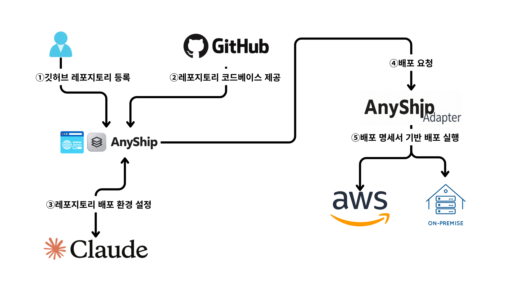

# AnyShip


## 개요

AnyShip은 GitHub 저장소 URL을 입력하면, AI가 12-factor 원칙을 기반으로 분석하여 코드를 배포 가능한 형태로 고치고 AWS나 온프레미스 서버에 배포해 주는 서비스입니다.

---

### 해결하고자 하는 문제

코드를 서버에 올리려면 앱을 환경에 맞게 고치는 일(설정 분리, 무상태화, 컨테이너화)과 환경마다 다른 배포 절차를 익히는 일이 필요합니다. AnyShip은 이 두 부분을 대신합니다.


**AI는 12-factor 원칙**을 기준으로 코드를 진단하고 변경해, Dockerfile과 '/healthz'를 만들어 GitHub에 PR로 올립니다.


어댑터와 환경을 맞춥니다. **앱은 환경을 모르고**, 환경별 차이는 사전에 작성한 어댑터와 인프라 구성 세트가 처리합니다. AI는 인프라 코드를 직접 만들지 않습니다.

---

### 아이디어

> 앱은 환경을 모르고, 환경은 외부에서 주입한다.


앱과 환경 사이에 환경 중립적인 배포 명세를 두고, 모든 환경에서 같은 컨테이너 이미지를 사용합니다.

이를 통해 AWS, 온프레미스를 같은 방식으로 다룰 수 있으며, GCP Azure는 어댑터를 추가하는 것으로 확장할 수 있습니다.

---

### 사용흐름 (https://app.anyship.cloud/)

1. GitHub로 로그인하고 저장소 URL과 기준 브랜치를 등록합니다.
2. 배포 환경(AWS 또는 온프레미스)을 연결합니다.
3. 분석을 요청하면 위반 목록과 수정 항목이 만들어집니다.
4. 변경안(diff)을 검토하고 선택해 GitHub Draft PR로 제출합니다.
5. 머지한 커밋을 이미지로 빌드해 환경에 배포하고, 진행 로그를 화면에서 확인합니다.



---

## 핵심 설계

### 설계 원칙

> 앱은 환경을 모르고, 환경은 외부에서 주입한다.

- 앱은 `DATABASE_URL`, `PORT` 같은 환경변수만 읽습니다. 어느 환경에서 실행되는지 알 필요가 없습니다.
- 환경별 차이는 **어댑터**와 **사전 구성 세트**가 처리합니다.
- 모든 환경에서 **같은 컨테이너 이미지**를 사용합니다.
- AI는 코드 수정, 세트 선택, 변수 값 설정만 합니다. 인프라 코드는 팀이 미리 작성합니다.

### 배포 명세

앱과 환경 사이의 계약입니다. 환경에 종속되는 값은 없고, AI가 코드를 보고 만들며 스키마로 검증합니다.

```yaml
app: todo-app
port: 8080                       # PORT 환경변수로 주입
healthcheck: /healthz
env:
  - name: SECRET_KEY
    secret: true
    generate: true               # 입력하지 않으면 어댑터가 생성
  - name: LOG_LEVEL
    value: info
backing_services:
  - type: postgres
    bind_as: DATABASE_URL        # 환경별로 RDS 또는 Postgres 컨테이너가 연결됨
release:
  migrate: alembic upgrade head  # 배포마다 일회성 작업으로 실행
workload:                        # AI가 세트를 고르는 근거
  type: request-driven
  max_request_seconds: 10
  websocket: false
```

### 사전 구성 세트

팀이 미리 작성한 인프라 템플릿입니다. AI는 `workload`를 보고 하나를 고릅니다.
같은 명세로 결과를 재현할 수 있고, AI가 보안에 취약한 인프라를 만드는 일을 막습니다.

| 세트             | 구성                                                      | 선택 조건                               | 상태   |
| ---------------- | --------------------------------------------------------- | --------------------------------------- | ------ |
| `aws-always-on`  | 공용 EC2 호스트 + Docker Compose + Traefik, 공용 RDS      | 긴 요청, 백그라운드 작업, 꾸준한 트래픽 | 구현됨 |
| `onprem`         | 사용자 서버 + Docker Compose + Traefik, Postgres 컨테이너 | 사용자가 온프레미스를 선택              | 구현됨 |
| `aws-serverless` | Lambda + Function URL + 공용 RDS                          | 짧은 요청, 간헐적 트래픽                | 예정   |

### 어댑터

모든 환경 어댑터는 같은 인터페이스(`check`, `deploy`, `status`, `rollback`, `destroy`)를
구현합니다. 서비스 본체는 환경이 어떻게 동작하는지 모르고 이 메서드만 호출합니다.

| 명세 항목           | AWS (always-on)                       | 온프레미스                         |
| ------------------- | ------------------------------------- | ---------------------------------- |
| 실행                | EC2 + Compose                         | Compose                            |
| 이미지 전달         | 서비스 서버에서 빌드 후 호스트로 전송 | 서비스 서버에서 빌드 후 SSH로 전송 |
| DB (`postgres`)     | 공용 RDS (앱 전용 계정)               | Postgres 컨테이너                  |
| 포트·HTTPS          | Traefik                               | Traefik                            |
| 롤백                | 이전 SHA로 재배포                     | 이전 SHA로 재배포                  |
| 스키마 마이그레이션 | 호스트에서 일회성 컨테이너 실행       | `compose run`                      |

온프레미스 서버에는 SSH로 접속해 배포 전용 계정으로 Docker 명령을 실행합니다.
인바운드 포트를 열 수 없는 사내망을 위한 에이전트 방식은 후속 범위입니다.

---

### AI의 역할과 통제

| 역할      | 출력                              | 통제 장치                          |
| --------- | --------------------------------- | ---------------------------------- |
| 진단      | 12-factor 위반 목록               | 결과를 화면에 표시                 |
| 변환      | 코드 diff, Dockerfile, `/healthz` | 검증 게이트 → PR, 위험 변경은 승인 |
| 명세 생성 | 배포 명세(YAML)                   | 스키마 검증                        |
| 세트 선택 | 세트 이름, 변수 값                | 규칙 검사 + Terraform `validation` |
| 근거 제시 | 선택 이유, 예상 비용              | 사용자 승인                        |
| 실패 분석 | 원인과 수정안                     | 재시도 상한 3회                    |

AI가 인프라를 직접 바꾸지 못하도록 `.tf` 파일은 생성·수정하지 않고, 허용된 범위의 값만 채웁니다.

### 배포 안전성
- **락**: 프로젝트 단위로 선점하며, 온프레미스는 서버(환경) 단위로도 선점해
  같은 서버를 쓰는 다른 프로젝트의 작업과 겹치지 않게 합니다.
- **만료와 복구**: 선점은 30분 뒤 만료되고 작업 중에는 로그 저장 때마다 연장됩니다.
  워커가 죽어도 다음 요청이 그 작업을 중단 처리하고 이어받습니다.
- **중복 방지**: 요청 ID로 같은 요청을 한 번만 실행합니다.
- **덮어쓰기 방지**: 늦게 끝난 옛 작업이 새 작업의 상태를 바꾸지 못합니다.
- **롤백**: 이전 커밋 SHA 이미지로 다시 배포하며 DB 스키마는 되돌리지 않습니다.

---

## 알려진 한계

현재 구현은 샘플 저장소를 대상으로 한 MVP입니다. 아래 항목은 알고 있으며 후속 범위입니다.

### 보안

| 한계                                                         | 영향                                                         | 현재 대응                                                    |
| ------------------------------------------------------------ | ------------------------------------------------------------ | ------------------------------------------------------------ |
| 사용자 레포의 Dockerfile을 **서비스 서버에서** 빌드합니다. 격리된 빌드 환경이 없습니다. | 악성 `RUN` 명령이 서버에서 실행될 수 있습니다. 서버 IAM 역할은 사용자 계정 AssumeRole 권한을 가집니다. | 샘플 레포에만 사용. 임시 복사본에서 빌드, `.git`·`.env*` 제외, 심볼릭 링크 미추적, AWS 환경·토큰을 빌드 프로세스에 전달하지 않음, 제한 시간 |
| AWS 온보딩 역할이 `AdministratorAccess`입니다.               | 서비스가 사용자 계정에서 필요 이상의 권한을 가집니다.        | 후속에서 최소 권한으로 축소                                  |
| 온프레미스 SSH 배포 키를 모든 환경이 **공유**합니다.         | 키가 노출되면 등록된 모든 서버가 영향을 받습니다.            | 배포 전용 계정, 키 인증만 허용. 환경별 키는 후속             |
| 앱 비밀을 호스트의 `app.env`에 저장합니다.                   | 호스트 교체 시 비밀이 유지되지 않고, 재배포마다 사용자 입력 비밀을 다시 넘겨야 합니다. | 로그와 결과에서 마스킹. Secrets Manager 보관은 후속          |
| 비밀 마스킹이 일반 비밀 탐지기를 대체하지 않습니다.          | 인식하지 못한 형식의 비밀이 남을 수 있습니다.                | 알려진 패턴 마스킹, 변경안에 비밀이 남으면 PR 결과 생성 거부 |

### 배포 대상과 연결

- 온프레미스는 **SSH 전송만** 지원합니다. 서버에 공인 IPv4와 22/80/443 접속이 필요하며, 사설망이나 인바운드를 열 수 없는 환경은 지원하지 않습니다(에이전트 방식은 후속).
- 시험한 서버는 Amazon Linux 2023 x86_64뿐입니다. Ubuntu 등은 검증하지 않았습니다.
- AWS는 상시 컨테이너(`aws-always-on`) 세트만 구현돼 있습니다. Lambda 세트는 없습니다.
- 파일 저장소(`object_storage`)는 경고 후 건너뜁니다.
- 앱 삭제는 컨테이너, 볼륨, 앱 폴더만 지웁니다. **앱 DB, 공용 기반(호스트·RDS), DNS 레코드는 남습니다.**

### 운영

- **원격 환경이 사라지면 삭제할 수 없습니다.** 인프라를 직접 지운 경우, 서버 접속에 실패하면 서비스의 배포 기록이 남고 프로젝트 연결 삭제도 막힙니다. 강제 제거(서비스 기록만 삭제)가 필요합니다.
- 서비스는 **단일 프로세스**로만 실행할 수 있습니다. 여러 Uvicorn worker나 여러 호스트로 분산하면 프로세스 잠금과 메모리 상태 때문에 동작하지 않습니다.
- 롤백은 이미지만 되돌립니다. **DB 스키마는 되돌리지 않으므로**, 마이그레이션이 바뀐 버전으로 롤백하면 앱과 스키마가 맞지 않을 수 있습니다.
- 기존 데이터를 새 환경으로 옮기는 기능이 없습니다.
- 앱 로그와 지표를 보는 화면이 없습니다. 배포 진행 로그만 제공하며, 실시간 푸시가 아니라 1~2초 간격 폴링입니다.

### AI와 변경 범위

- 개발 모드(`APP_AI_MODE=placeholder`)에서는 실제 AI 대신 안내 주석 파일을 추가하는 고정 항목을 반환합니다.
- 웹 워커는 **Docker 검증 게이트를 실행하지 않습니다.** 결과는 `skipped`, `pr_eligible=false`이며 통과로 취급하지 않습니다. Draft PR 생성은 전체 기능 검증이나 배포 승인이 아닙니다.
- 변경안은 최대 100파일, 2 MiB이며 파일 삭제와 이름 변경은 지원하지 않습니다.
- 소스 분석 한도: 파일당 512 KiB, 총 20 MiB, tree 항목 2,000개. 링크·서브모듈은 지원하지 않습니다.
- 항목별 수정 재실행과 PR 커밋의 자동 배포 연결은 후속입니다.

---

